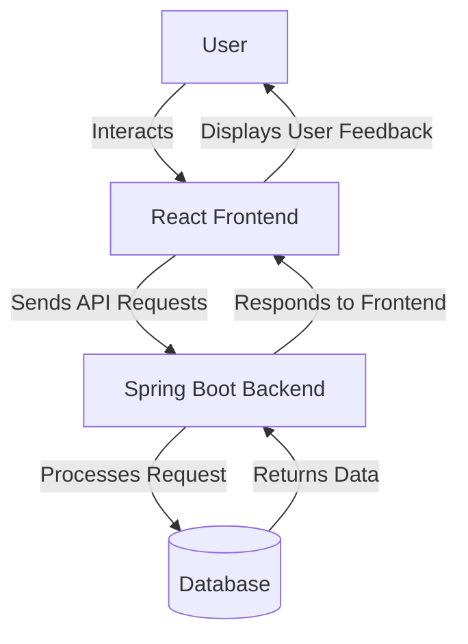

# 3-tier application
### Project Overview
Develop a 3 tier application and run in local machine. create a custom dockerfile for each tier.Create a volume and attach the database container.
## Features
* Add Employee list
* Show employee list
## 1. Installation 
### 1.1  Prerequisites
> 1. Java 17
> 2. Maven 3.8.8
> 3. NodeJs 14.x
> 4. MySQL 8.x
### 1.2 Setup Instructions
#### Step 1 : 
```bash
git clone https://github.com/username/project-name.git
cd project-name
```
#### Step 2 :
```bash
npm install
```
#### Step 3 :
> Environment setup
#### Step 4 :
```bash
npm start
```
## 2 . Architecture Overview

### Flow chart

