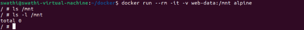
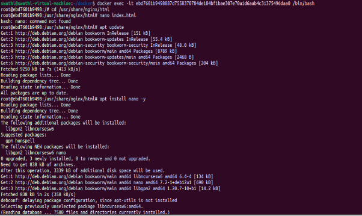
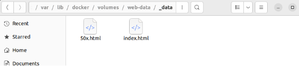

**DOCKER VOLUME**

Docker Volumes are a popular and effective method for assuring data permanence while working in containers. Docker volumes are file systems that are mounted on Docker containers to preserve the data generated by the container. All volumes are managed by Docker and stored in a dedicated directory on your host, usually /var/lib/docker/volumes for Linux

- volumes are stored independently on the host machine. This ensures that data remains available even if the container is stopped, restarted, or removed.
- Volumes are managed directly by Docker, making them a preferred choice for handling persistent storage needs.
- They are highly flexible and can be shared between multiple containers, making them ideal for use cases such as databases, logs, and shared configuration files.
- Additionally, volumes offer improved performance, ease of backup and restoration, and consistency across different environments, making them an essential component in modern containerized applications.

**Docker volume Creation**

- Create a new docker volume
- Command: **Docker volume create volume-name**

**Docker volume ls – It shows a list of voulume**

**Docker run -rm -it -v volume-name :/mount to directory inside container**

**docker run:** Starts a new container from a specified image.

` `**--rm:** Ensures that the container is automatically removed when it stops. This avoids leftover containers cluttering your system

` `**-it:**

- Allocates an interactive terminal session:
  - -i: Keeps the standard input open (interactive mode).
  - -t: Allocates a pseudo-terminal.

**-v web-data:/mnt/alpine:**

- Mounts a volume into the container:
  - web-data: The volume name (created automatically if it doesn’t exist).
  - /mnt/alpine: The mount point inside the container where the volume will be accessible.

**alpine:** Specifies the Docker image to use. The alpine image is a minimal Linux distribution, often used for lightweight tasks.

**docker run -v <volume>:/path <image> - Mount a volume in a container.**

Docker run -d -v web-data:/usr/share/nginx/html -p 85:80 –name application nginx

Volume assigned to container in path/usr/share/nginx/html

Localhost 85 nginx run on web browser

Docker exec -it <container id> /bin/bash- The command you provided is used to **access the shell of a running Docker container**.

` `**docker**: The Docker CLI command to interact with Docker.

**exec**: Executes a command inside a running container.

` `**-it**: This option **-i** Keeps STDIN open even if not attached, allowing interaction with the container. The**-t** Allocates a pseudo-TTY (terminal) for the session.

**ebd7601b9498887d558378784debf1bea384f1bae307e016aeab4c31375496daa0**

- The **container ID** of the running container you want to access. This can also be replaced with the container name.

**/bin/bash**: Specifies the command to execute inside the container. Here, it opens a Bash shell.

In root mode ,update the apt first then install nano package for open and  editing the script file

Change the code

**Stop the localhost- docker stop <container-id>**

**Again the start the container in localhost**

**You can see the changes made in webpage**

**Docker volume inspect <volume-name>-check the volume details**

Docker stored the file in directory on host

**Issue**: In root mode within the container, there is no internet connectivity, so I cannot install packages.
**Solution**: Find the resolv.conf file and open it using the cat command. Then, add a new nameserver 8.8.8.8 by editing the file with the cat command.

Adding nameserver 8.8.8.8 to the /etc/resolv.conf file is used to configure the system to use **Google's public DNS server** for domain name resolution.

Navigate to etc/ open **resolve.conf** using cat command. This will display the current DNS configurations.

**Cat >resolv.conf** -open in editing mode manually change the nameserver 8.8.8.8 .Press Ctrl+D to save and exit .Next verify the content open the file.

