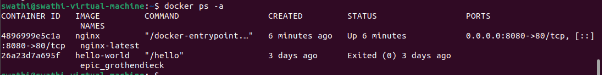
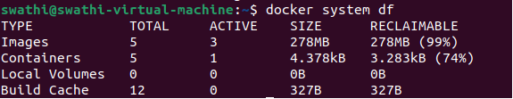

**DOCKER PART -1**

**Docker :**

- Docker is a **container runtime engine** that takes up some space on your system to store the libraries and dependencies required for specific applications.
- It packages these resources in an isolated environment and runs them as containers. 
- This process ensures that applications run consistently across different systems, and this entire mechanism is referred to as Docker.
- It can avoid or reduce the infrastructure cost

**For example**: Let’s say Tomcat 8.5 is running on Ubuntu. If Ubuntu stops supporting this version of Tomcat, you can run it on Red Hat or centralized means, If you cannot upgrade a particular version of software for a specific time, it may become inoperable. To use a different version, you might need a new operating system and an additional server machine. Docker eliminates all these issues by allowing you to run different versions in isolated containers on the same machine.

**Container**

- Docker container is a runtime instance of an image. Allows developers to package applications with all parts needed such as libraries and other dependencies.
- Docker Containers are runtime instances of Docker images. 
- Containers contain the whole kit required for an application, so the application can be run in an isolated way. 

**Docker Image**

Image is a file in the template formate is a set of instruction used to create docker container in a read only format.

**Docker Commands:**

**Docker images**

docker pull image name:Download a image from registry

Docker images :list all downloaded images

Docker rmi <image >:Removes a specific image

**Docker Containers:**

docker run –name <container name><image name> - Run a container from an image.

docker run -d <image> - Run a container in detached mode.

Detached mode in Docker allows you to run containers in the background, enabling continuous operation without tying up your terminal.

Docker run -d -p <port on host>:<port on container> --name <container name><image name>: run a container with ports

Docker ps:** listing all running containers

Docker ps -a **:** listing all the containers,including stopped ones

Docker stop <container name>: stop a running container

Docker start <container name>:** Start a stopped container

Docker  restart <container name>: Restart a stopped container

Docker rm <container ID>: Remove a stopped container

Docker logs <container name>:View logs of a container

docker inspect <container name>** : Get detailed information about a container

Docker inspect <Image id>: This command provides detailed metadata, including layers configuration, and more. 

docker exec -it <container> <command> - Execute a command inside a running container

**System Management**

docker system df - Show Docker disk usage

docker system prune - Remove unused Docker data (stopped containers, dangling images, etc.)

docker stats -** Display real-time stats of running containers

** 

docker info -** Display Docker system-wide information

** 

**Networks**

docker network ls - List all docker networks

**

**DOCKER FILE** 

A Dockerfile is a text-based document that's used to create a container image. It provides instructions to the image builder on the commands to run, files to copy, startup command, and more.

Docker file Instructions are used to Create the Docker Images.Some of the most common instruction in docker file

- **FROM <image>** - this specifies the base image that the build will extend.
- **WORKDIR <path>** - this instruction specifies the "working directory" or the path in the image where files will be copied and commands will be executed.
- **COPY <host-path> <image-path>** - this instruction tells the builder to copy files from the host and put them into the container image.
- **RUN <command>** - this instruction tells the builder to run the specified command.
- **ENV <name> <value>** - this instruction sets an environment variable that a running container will use.
- **EXPOSE <port-number>** - this instruction sets configuration on the image that indicates a port the image would like to expose.
- **USER <user-or-uid>** - this instruction sets the default user for all subsequent instructions.
- **CMD ["<command>", "<arg1>"]** - this instruction sets the default command a container using this image will run. There can only be one CMD instruction in a Docker file. If you list more than one CMD then only the last CMD will take effect.

`                                                               `**CREATE A DOCKER FILE**

**Step : 1 Create a Project directory**

mkdir docker

cd docker

**Step : 2 Create an HTML file**

Create an index.html file in **sudo nano index.html**

**Step : 3 Create the dockerfile**

Create a file named  “dockerfile” and edit in nano - **sudo nano dockerfile**

In the docker file

**Step :4** Build the docker Image

**docker build -t new-nginx-image .**

**Step : 5** Run nginx container

**docker run –name my-new-nginx-p 8081:80 -d new-nginx-image**

**Access in web browser**

