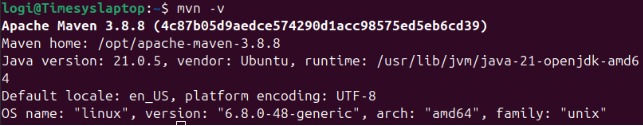
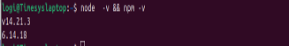
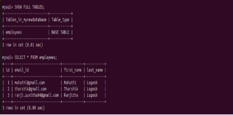
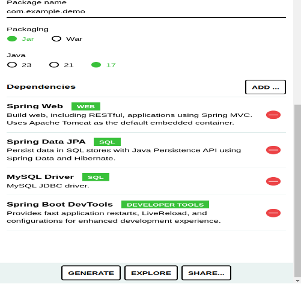
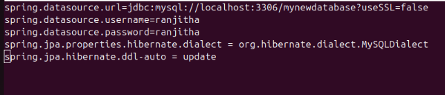
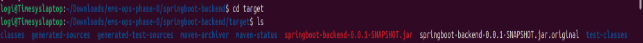
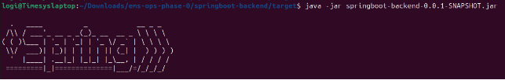
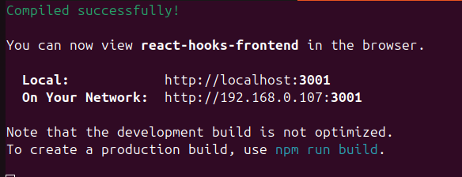
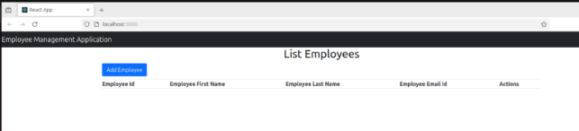
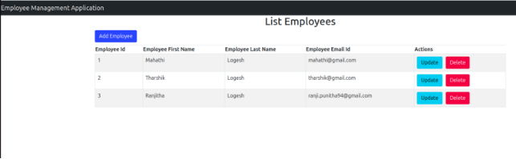

`            `**Full stack web Application**

`              `**(Build and deploy Application)**

####Detailing of structure of Application

       \* ReactJS Frontend
       \* Java SpringBoot backend
       \* MySQL RDBMS
          
####**Build Web Applications**

####Following toolset to be installed as the first step

`     `\* Java 17 

`     `\* Maven 3.8.8

`     `\* NodeJs 14.x

`     `\* MySQL 8.x

####**Tools Installation steps(Ubuntu based)**

``**Step1**:**Java**

- sudo apt update
- sudo apt install openjdk-17-jdk openjdk-17-jre

`**Step2**:**Maven** 

- wget <https://dlcdn.apache.org/maven/maven-3/3.8.8/binaries/apache->[  maven-](https://dlcdn.apache.org/maven/maven-3/3.8.8/binaries/apache-maven-)3.8.8-bin.tar.gz

- tar -xvf apache-maven-3.8.8-bin.tar.gz

- mv apache-maven-3.8.8 /opt/ 

####``**Maven M2\_HOME Setup**

####`\* Open the profile file `vim ~/.profile`  of the user and the following and save the file.

`     `####It means that Vim is being instructed to open the .profile file located in home directory.

####set path Maven M2\_HOME

`     `M2\_HOME='/opt/apache-maven-3.8.8'

`     `PATH="$M2\_HOME/bin:$PATH"

####`**Install maven**

- sudo apt install mvn
- mvn -version

**Step3: NodeJs**

- sudo apt update

- curl -o- https://raw.githubusercontent.com/nvm-sh/nvm/v0.39.1/install.sh | bash

- source ~/.bashrc

`     `#### This command reloads your shell configuration file, allowing the changes made by the installation script to take effect immediately.

- nvm install 14                           ///(Node Version Manager)

  `   `#### install a specific version of Node.js (version 14)

- sudo apt -y install nodejs && npm

  `   `####install Node.js and npm         ////(Node Package Manager)

- node  -v && npm -v

  `   `####checks and displays the currently installed versions of Node.js and npm.

**

**Step4:MySQL**

####``**Install MySQL Server**

- sudo apt update

- sudo apt install mysql-server

####``**Update `root` user password**

- **sudo mysql**

      ####This command is to Log in to MySQL as the root user.

      #### I recevie "mysql>"prompt

-**ALTER USER 'root'@'localhost' IDENTIFIED WITH mysql\_native\_password BY 'password';**

      ####Replaced password as 'ranjitha'

-**exit**

      ####It will exit from root user.

####``**Configure User** 

-**sudo mysql -u root -p**

`     `####After executing this, password command will be asked ‘ranjitha’

-**CREATE USER 'username'@'%' IDENTIFIED WITH mysql\_native\_password BY 'password';**

`     `####This command create new user and password.username=’**ranjitha**’; password=’**ranjitha’**

-**GRANT ALL PRIVILEGES ON \*.\* TO 'username'@'%' WITH GRANT OPTION;** 

 `    `####replace username as ‘ranjitha’
       
      `####The 'WITH GRANT OPTION' allows this user to grant privileges(Granting privileges enables users to perform actions such as SELECT, INSERT, UPDATE, DELETE, and more on specified database objects.) to other users.

-**FLUSH PRIVILEGES;** 

`     `####This command reloads the grant tables in MySQL, ensuring that any changes made take effect immediately.

-**exit**

`     `####Once you have completed your tasks, exit the MySQL shell.

####**Create Database**

-**sudo mysql -u username -p**

`     `####This command to log into MySQL as a specific user (replace username ‘ranjitha’)

`     `####After entering this command, you will be prompted to enter the password for the specified user. Type the password ‘ranjitha’ and press Enter.

-**CREATE DATABASE mynewdatabase;**

`     `####Once logged into the MySQL shell, you can create a new database '**mynewdatabase**'

-**SHOW DATABASES;**

`     `####To confirm that the database was created successfully, list all databases.

####**Check details inside my databases** 

####Log In to MySQL:

-**`mysql -u ranjitha -p**

####**Select Your Database**:

-**`SHOW DATABASES;**

`     ####**mynewdatabase** 

-**USE mynewdatabase**

`     `####To use our database

-**SHOW FULL TABLES;**

      `####`Show details inside our table.

-**SELECT \* FROM employees;**

      `####`See information about employees. 

####**Run the application**

####**Backend Setup**

**Step5:Create Spring Boot Application**

`     `Go to Spring Initializr to generate a Spring Boot project:

`	  `Select Maven Project.

`	  `Choose Java and the appropriate version.

`	  `Add dependencies: Spring Web, Spring Data JPA, MySQL Driver, and Spring Boot DevTools.

`	  `Click on Generate to download the project.

**Step6:cd  ~/Downloads/ems-ops-phase-0/springboot-backend**

`     `####Use the cd command to change to the Downloads directory (or wherever your ZIP file is located)**cd ~/Downloads**

`     `####install unzip **sudo apt install unzip**

`     `####Use the unzip command followed by the name of your ZIP file to extract it.(unzip filename.zip)

-**find ~ -type d -name "springboot-backend"**

`     `####This command will search for a directory named springboot-backend starting from your home directory.

`     `####After extracting, you might want to move into project directory (springboot-backend) is a subdirectory created during extraction.

####``**Update Application Properties**

**Step7:nano src/main/resources/application.properties**

`     `####This directory contains details of `DB` . Have to update the username , password that we have created above.

-**Step8:nano pom.xml** 

`     `#### Add all its dependencies

`     `####java version=21

`     `####maven version 3.3.4

`     `####lombok version=1.18.36

`     `####mysql version=8.0.33

**Step9:Build the Spring Boot Backend application**

-**mvn clean**

`     `####This command removes any previously compiled files and ensures a fresh build.

-**mvn install**

`     `####This command to build and package the application . This will generate a `target` folder under `springboot-backend`  and `\*.jar` file will be generated

` 

####**Run the spring boot application**

-**Step10:cd /home/logi/Downloads/ems-ops-phase-0/springboot-backend/target** 

-**Step11:java -jar springboot-backend-0.0.1-SNAPSHOT.jar**     ///(command to run springboot backend) 

                       

`     `####Before running check if any application runs on port `8080` in web browser by using

-**sudo lsof -i :8080**

`     ####`If any application like Tomcat is running in port 8080 stop the process using ‘sudo systemctl stop tomcat’.Then run the jarfile.orelse

-**Kill -9 <PID>**

####Frontend Setup**

**Step11:cd  ~/Downloads/ems-ops-phase-0/react-hooks-frontend**

####Build the frontend application**

**Step12:`npm install**

`	  ####`This command will create a node\_modules folder in your project directory, which contains all the installed packages and dependencies.

####Run the Application**

**Step13:npm start**                      ///(command to run frontend)

`     ####`Default it open a browser window pointing to [http://localhost:3000](http://localhost:3000/).

`     ####`Now Add employee details.submit it.and can update details.

      ####After compiled successfully automatically you will receive the screen

      ####you can Add employee detaills

      ####It automatically saved in database folder created above.
