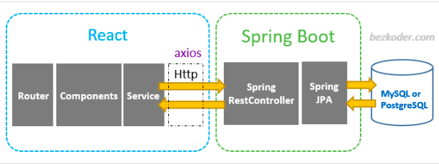

`          `**Full stack web Application**

`           ####`**(React,spring boot,mysql)**

 **A full stack application** is an integrated solution that combines both frontend and backend technologies to deliver a complete user experience.

` `Full stack development allows developers to create applications from start to finish efficiently while maintaining a cohesive architecture

####**1.Frontend Development**:

1. The frontend is the part of the application that users interact with directly. It includes everything that users see and experience in their web browsers, such as the 

layout, design, and user interface (UI).

    Common technologies used in frontend development include:
              
               1. **HTML** (Hypertext Markup Language)
               1. **CSS** (Cascading Style Sheets)
               1. **JavaScript** (and libraries/frameworks like React, Angular, or Vue.js)

####**Backend Development**:

1. The backend is the server-side of the application that handles business logic, database interactions, authentication, and data processing.
   
2. It is responsible for managing the application's data and ensuring that it communicates effectively with the frontend. 
      
       Common technologies used in backend development include:
               
               1. **Programming languages** like Java, Python, Ruby, PHP, or Node.js
               1. **Frameworks** like Spring Boot (for Java), Django (for Python), or Express.js (for Node.js)
               1. **Databases** such as **MySQL**, PostgreSQL, or MongoDB

####**3.MYSQL databse**

   `MySQL is an open-source relational database management system (RDBMS) that allows users to store, manage, and retrieve structured data efficiently

####**Architecture Diagram**

**Client (ReactJS Frontend)**

Represents the user interface where users interact with the application.

**Server (Java Spring Boot Backend)**

Handles business logic, processes requests from the frontend, and interacts with the database.

**Database (MySQL)**

Stores application data and handles data retrieval and manipulation requests from the backend.

####**Flow Diagram**

`**User Action**: A user performs an action on the ReactJS frontend (e.g., submits a form).

``**API Call**: The frontend sends an HTTP request to the Spring Boot backend.

``**Request Handling**: The Spring Boot backend receives the request and processes it.

``**Database Interaction**: The backend interacts with the MySQL database to retrieve or modify data based on the request.

``**Response Generation**: The backend generates a response (success message, data) and sends it back to the frontend.

``**UI Update**: The ReactJS frontend receives the response and updates the user interface accordingly.

                                            [ User Action ]
                                                    |
                                                    |
                                            [ ReactJS Frontend ]
                                                    |
                                                    |   HTTP Request
       
                                            [ Java Spring Boot Backend ]
                                                    |
                                                    |   Database Query
       
                                            [ MySQL Database ]
                                                    |                                                     
                                                    |   Data Response
       
                                            [ Java Spring Boot Backend ]
                                                    |
                                                    |   HTTP Response
       
                                            [ ReactJS Frontend ]
                                                    |
                                                    |
                                            
                                            [ UI Update ]
	
