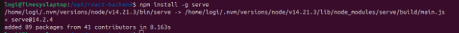

`            `**Daemonize the services**

####**1. Java Backend**

**Step1:**cd /opt

**Step2:**create folder in /opt dir ‘java-backend’

**Step3:**cd /opt/java-backend

**Step4**:cp -r /home/logi/Downloads/ems-ops-phase-0/springboot-backend/target/springboot-backend-0.0.1-SNAPSHOT.jar **.**

####**Create `SystemD` Service**

**Step5:**sudo nano/etc/systemd/system/app\_ems.service

`    `[Unit]

`        `Description=StudentsystemApplication Java service

`        `After=syslog.target network.target

`     [Service]

`        `SuccessExitStatus=143

`        `User=logi

`        `Type=simple

`        `Restart=on-failure

`        `RestartSec=10

`        `WorkingDirectory=/opt/java-backend/

`        `ExecStart=/usr/bin/java -jar springboot-backend-0.0.1-SNAPSHOT.jar

`        `ExecStop=/bin/kill -15 $MAINPID

      [Install]

`        `WantedBy=multi-user.target

`**Step6: Daemon Reload & systemctl cmd**

\    `sudo systemctl daemon-reload

`    `sudo systemctl start app\_ems.service

`    `systemctl status app\_ems.service

\
####React Front**

**Step1**:cd /opt

**Step2:**create folder ‘react-backend’

**Step3**:cd /opt/react-backend

**Step4:** Copy the `build` folder generated in using `npm run build`

**Step5:** cp -r /home/logi/Downloads/ems-ops-phase-0/react-hooks-frontend/build **.**

**Step6:**Install `serve` node package

\- `npm install -g serve`

####**Create `SystemD` Service**

**Step7**:sudo nano /etc/systemd/system/reactapp\_ems.service

`     `[Unit]

`        `Description=StudentsystemApplication React service

`        `After=syslog.target network.target

`     `[Service]

`        `SuccessExitStatus=143

`        `User=logi

`        `Type=simple

`        `Restart=on-failure

`        `RestartSec=10

`        `WorkingDirectory=/opt/react-backend/

`        `ExecStart=/home/logi/.nvm/versions/node/v14.21.3/bin/serve -s build

`        `ExecStop=/bin/kill -15 $MAINPID

`     `[Install]

`        `WantedBy=multi-user.target

**Step7: Daemon Reload & systemctl cmd**

`    `sudo systemctl daemon-reload

`    `sudo systemctl start reactapp\_ems.service

`    `systemctl status reactapp\_ems.service

