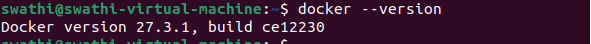

**DOCKER INSTALLATION**

**Step 1: Update the System**

Update the package index and upgrade installed packages to ensure the system is up to date.

Command : **sudo apt update && sudo apt upgrade -y**

**Step 2: Install Required Dependencies**

Install necessary packages for setting up Docker.

Command : **sudo apt install -y ca-certificates curl gnupg lsb-release**

**Step 3: Add Docker’s GPG Key**

Add the official Docker GPG key to verify package authenticity.

Command: **sudo mkdir -p /etc/apt/keyrings**

**curl -fsSL https://download.docker.com/linux/ubuntu/gpg | sudo gpg --dearmor -o /etc/apt/keyrings/docker.gpg**

**Step 4: Add Docker Repository**

Add Docker’s official APT repository to the system.

Command: **echo "deb [arch=$(dpkg --print-architecture) signed-by=/etc/apt/keyrings/docker.gpg] https://download.docker.com/linux/ubuntu $(lsb\_release -cs) stable" | sudo tee /etc/apt/sources.list.d/docker.list > /dev/null**

**Step 5: Update Package Information**

Update the package list to include Docker packages.

Command: **sudo apt update**

**Step6: Install Docker Engine**

Install Docker Engine, CLI, and required plugins.

Command: **sudo apt install -y docker-ce docker-ce-cli containerd.io docker-buildx-plugin docker-compose-plugin**

**Step 7: Verify Docker Version**

To ensure that Docker was installed correctly, check its version

Command: **docker –version**

**Step 8: Verify Docker Installation**

Check Docker’s status to ensure it is installed and running.

Command: **sudo systemctl status docker**

**Step 9: Enable Docker to Start on Boot**

Enable the Docker service to start automatically at boot.

Command: **sudo systemctl enable docker**

**Step 10: Allow Running Docker Without sudo (Optional)**

1. Add your user to the docker group:

   Command: **sudo usermod -aG docker $USER ->  sudo usermod -aG docker swathi**

1. Log out and log back in, or restart your session:

   Command : **newgrp docker**

1. Verify your user is in the docker group

   Command : **groups**

**Step 11: Test Docker**

Run a test container to confirm Docker is working correctly:

Command: **docker run hello-world**

**Docker**

- Docker is an open-source platform designed to automate the development, deployment, and management of applications using containers.
- Containers are lightweight, standalone, and portable executable packages that include everything needed to run an application: code, runtime, libraries, and system dependencies.
- Docker ensures consistent environments from development to production, making it a popular choice for DevOps practices.

